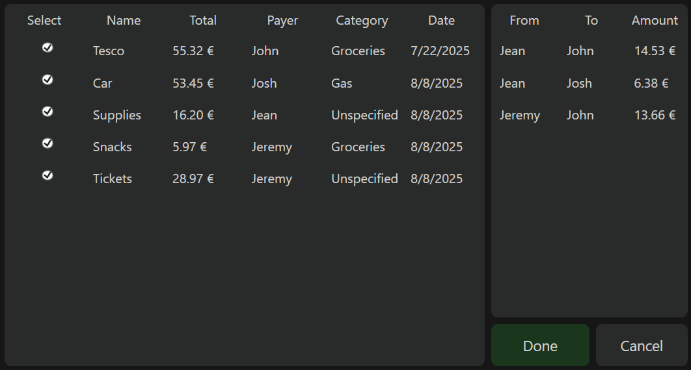

# FairSplit

A WPF desktop app for managing, sharing and settling expenses between friends.

---

## Features

- **Group management**  
  Create and manage multiple friendgroups.  
- **Add & track transactions**  
  Log purchases with payer, share amounts, category, and timestamp.  
- **Optimized settlement algorithm**  
  Uses a custom, graph-based, debt-balancing algorithm to compute the minimal set of settlement payments. 
- **Visual summaries**  
  LiveCharts pie charts display each roommate’s share and expense categories.  
- **Persistence**  
  Local database via Entity Framework Core.  
- **Clean MVVM architecture**
- **Adaptive WPF UI**  

---

## Screenshots

| Select Group                   | Group Overview                   |
|--------------------------------|----------------------------------|
|  |  |

| Settlement         | Adding Transaction               |
|--------------------------------|----------------------------------|
|           |  |

---

## Technologies Used

- **.NET 7** - Application framework  
- **WPF** - Desktop UI toolkit  
- **MVVM** - Clean separation of UI, logic, and data  
- **LiveCharts.Wpf** - Interactive charts and graphs  
- **Entity Framework Core** - Data persistence

---

## License
This project is licensed under the [Apache License 2.0](./LICENSE).

